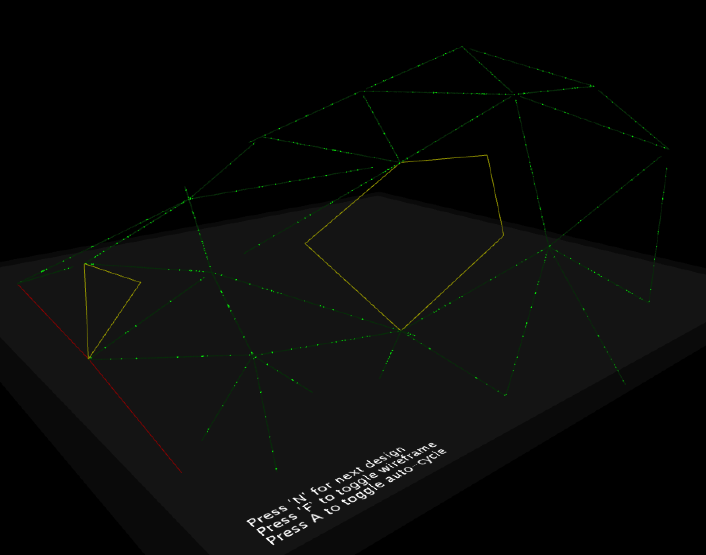

# Dino LEDs

## Setup

* Download & Run [Processing](https://processing.org/)
* Go to Sketch -> Import Libraries -> Add Library, Search "PixelPusher", and install that library.
* Restart Processing.
* Download or git clone this project.
* Open Dino.pde from the project folder.

## Running
You can simply press the 'play' button at the top of the screen to start the program. It should show you a model of a dino in a window, and moving the mouse moves the camera around a little bit.

The program will automatically cycle through all lighting designs, changing every 60 seconds.

### Controls
The mouse moves the camera. There are 3 keyboard controls:
 * 'N' goes to the next lighting design
 * 'A' turns off auto-cycle
 * 'F' displays a wireframe of the dino

## Display settings
The program can be run in two display modes. The default mode is a 3d drawn environment of the Dino & the light strips on the dino. If your computer is slow, or if this is running at burning man and we don't need the visualization, you can use the 'Simple Draw' mode. This only draws the led strips in a 2d grid. To use simple draw, set `kSimpleDraw` to `true`.

If you want to have a full-screen dino, then you can change the line that says `size(1024, 1024, P3D)` to `fullScreen(P3D)`.

## Adding a new lighting design
All lighting designs implement the `LightingDesign` interface, and the program cycles through designs in the `designs` array in the Dino file. To add a new design, create a new tab for your design and create a class, just like a Java class. See other lighting designs for examples. Add your design to the beginning of the list in the Dino tab to see it right away.

The program uses the `Model` (specifically the `DinoModel`) to ask lighting designs for colors for leds. Your lighting design is given a strip number, led number, and `Vec3` position (x,y,z) of the LED. You can get more information about the model by looking at the `Model` object given to you in the `init(Model)` method. For example. you can get the minimum & maximum x, y, and z values for the model.

There are some more utility functions for the model the `Model` file, like getting the center of the model, and other utilities in the `Util` file.

## Running with PixelPushers
Sometimes processing has exceptions when you run in from the IDE and you're pushing pixels (only if you're pushing Pixels). Exporting the project to an application and running it that way seems to solve this problem.
